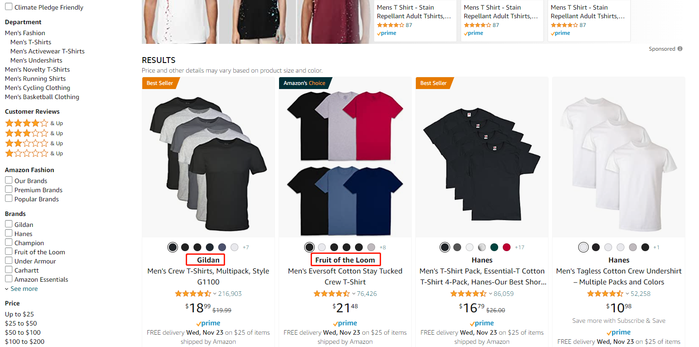
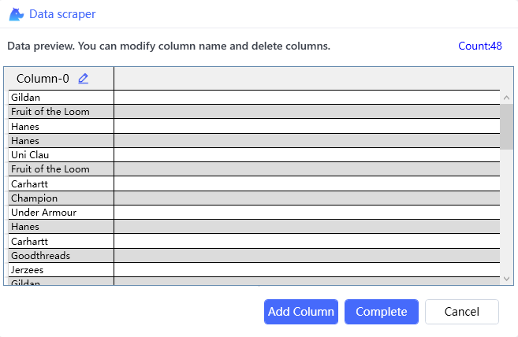
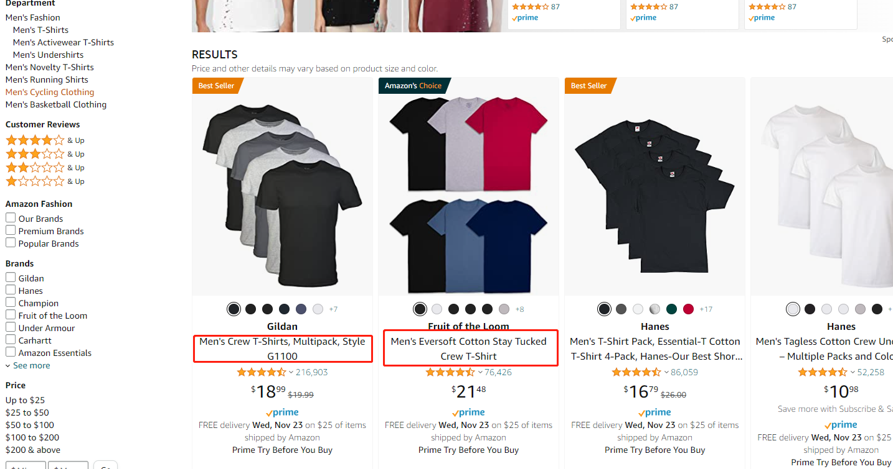
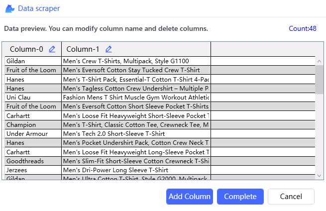

## Use python automation library clicknium to scrape Amazon website data

Use the python automation library **[clicknium](https://www.clicknium.com/documents)**  to scrape Amazon website data. The library provides complete automation functions, supports desktop software, web pages, Java applications, SAP applications, and even image recognition, and is very intuitive and convenient to use. Clicknium can be used without difficulty if you know how to use Python. The sample demonstrates how to use the new feature of data scraping.

### How to use scrape data:
1. Assume you've set up Clicknium and can run the demo without issue.

2. Open Amazon site and search 't-shirts for men', then start the clicknium record, and click data scraper button, you will see the wizard page.

3. We will generate extracting data rules by capture control elements. For example, to extract the brand name, you can capture the following two items, the extraction rules will be generated, and the wizard page will show the preview data.
   
   

4. We can extract product description at the same time. Click 'Add Column' button, capture the follow two elements.
   

   
5. You can extract the price by repeating the above steps.

6. Click 'complete' button

### How to use in python code
```python
objs = cc.scrape_data(locator.amazon.div_container)
# This method also supports other parameters, please refer to official documents
```

### code
```python
import subprocess
from time import sleep
from clicknium import clicknium as cc, locator, ui

def main():
    if cc.chrome.extension.install_or_update():
      print("Please open chrome browser to enable clicknium extension, then run sample again.")
      return
    # open amazon website        
    tab = cc.chrome.open("https://www.amazon.com/")
    # input key words
    tab.find_element(locator.amazon.text_search).set_text('t-shirts for men')
    # click search button
    tab.find_element(locator.amazon.btn_search).click()
    # wait the first page load
    sleep(5)
    # 'locator.amazon.next_page' is next button locator, it will get top 5 page results.
    objs = cc.scrape_data(locator.amazon.div_container,{},locator.amazon.next_page,max_count=48*5)
    print(objs)
    
    sleep(3)
    tab.close()

if __name__ == "__main__":
    main()

```

### Get the source code
[mspaint-draw-img](https://github.com/automation9417/mspaint-draw-img)


